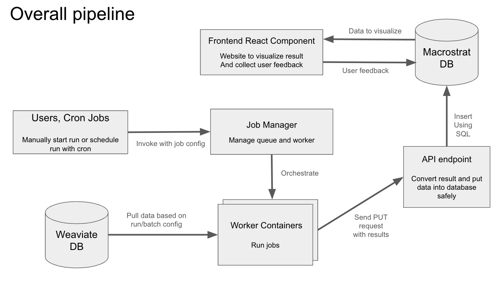

# macrostrat-xdd
Describe Macrostrat rock units using the scientific literature

This is a place to start compiling code and resources used to build better rock-record descriptions from the
geologic literature as part of the [**DARPA CriticalMAAS**](https://github.com/UW-Macrostrat/CriticalMAAS)
project.


## General research plan

These project two primary goals: 
- [Concepts linked to geologic units](notes/unit-description.md) can be used to help fill out a graph of units, their attributes, and names
- New units can be discovered by proximity to known entities

We developed an initial version of the system to utilize paragraphs from xDD to build better rock-record descriptions:



We describe each of the components in detail here. 

## Weaviate DB

[Weaviate DB](https://weaviate.io/) is a vector database that we populate with paragraphs from xDD. The workers utilize [weaviate's Python library](https://weaviate.io/developers/weaviate/client-libraries/python) to fetch the paragraphs from Weaviate to process. 

## Job Manager

The job manager uses a Redis job queue to communicate tasks to workers. The manager pulls paragraph ids from Weaviate which is sent to the workers. 

You can build and start the Redis server along with the manager like so:
```
$ cd job_manager
$ docker-compose up --build
```

Be sure to have a `.env` file to specify configurations for the Redis server, Weaviate, etc. 

## Worker Containers

We have developed two different LLM/ML based approaches to extract rock descriptions from paragraphs. Both approaches process text by paragraph and output relevant relationship triplets:

- [`UW-Macrostrat/llm-kg-generator`](https://github.com/UW-Macrostrat/llm-kg-generator/):
  Utilizes LLMs for few-shot extraction of relationship triplets (_Bill Xia_). Prompt engineering is employed to provide LLMs
  with guidance and background knowledge necessary for their tasks. Refer to the repository, for more details on how to
  run the container in tandem with the job manager.

- [`UW-Macrostrat/unsupervised-kg`](https://github.com/UW-Macrostrat/unsupervised-kg):
  Knowledge graph construction to discover new geologic entities in the
  scientific literature (_Devesh Sarda_). This system processes a corpus of documents
  to discover the relationshiops between system components, storing the result as a traversable graph. It is in early
  development, but seeks to illuminate the links and structured relationships between different geologic entities.

## API Endpoint

The API endpoint is a Flask server that uses SQLAlchemy to verify the input data and insert it into the macrostrat database. The code for the server can be found in the `macrostrat_db_insertion` directory. 

We have provided a conda environment that contains all of the necessary dependencies which you can setup using:
```
$ cd macrostrat_db_insertion
$ export CURRENT_DIR=`pwd`
$ cd docker
$ docker build -t db_insert .
$ docker run -d -v $CURRENT_DIR:/working_dir/ --name=db_insert -p 9543:9543 db_insert:latest sleep infinity
$ docker exec -it db_insert bash
$ conda activate db_insert_env
```

Then you can launch the server using:
```
$ python server.py &> server.out &
```

which will launch the server on port `9543` as a background process. Note that the server connects to the database using the configuration specified in: `dev_macrostrat.json`, which currently just contains dummy data but should be replaced with actual connection information to connect to macrostrat DB. 

Once the server is launched you can make a request to the server using:

```
$ python insertion_test.py
```
which will send the request data in `example_request.json` to the server to be inserted into the DB. Note that currently have this server running at: `http://cosmos0003.chtc.wisc.edu:9543/record_run`. 

## Frontend React component

The frontend React component can be found in this repo: [UW-Macrostrat/web-components](https://github.com/UW-Macrostrat/web-components/tree/main/packages/feedback-components). A current version of this feedback component can be found at [http://cosmos0003.chtc.wisc.edu:3000/?path=/docs/feedback-components-feedbackcomponent--docs](http://cosmos0003.chtc.wisc.edu:3000/?path=/docs/feedback-components-feedbackcomponent--docs) 
